<h1 align="center"> YangMiee攻击面梳理平台 </h1>

<p align="center">


<p align="center"> YangMiee攻击面梳理平台，它基于原项目<a href="https://github.com/Symph0nia/CyberEdge">CyberEdge</a>进行开发，是一个网络安全工具，用于全面扫描和评估目标系统的安全状况，包括从资产到漏洞的层层深入分析。</p>

## 👋YangMiee攻击面梳理平台介绍

版本：V1.0.0

### 主要二开部分
因为工作和学业的时间原因，对原项目的功能添加并不多，大部分还是在修改界面和修复原项目的一些bug，也是为了在当前阶段有一个更好的用户体验。
后续会慢慢接入更多具有实践意义的功能以及优化性能。

感谢ZacharyZcR师傅开源的原项目～

feat: 前后端集成，实现单一二进制部署运行

feat: 重构Docker部署流程，简化部署步骤

feat: 增加GoGo工具作为漏洞扫描组件

feat: 统一前端主题为浅色系，增加仪表盘，优化数据展示，适应不同用户体验

fix: 修复多个前端和后端bug，主要包括前端数据渲染、按钮失效、完善和修复后端接口功能

### TODO List

1. 完成综合扫描任务
2. 前端细节优化
3. 修复bug

## 🚀主要功能

1. **子域名扫描**：使用Subfinder工具进行子域名扫描，发现目标域名的所有子域名。
2. **端口扫描**：使用Nmap进行端口扫描，发现目标系统开放的端口和服务。
3. **路径扫描**：使用Ffuf工具进行Web目录和路径扫描，发现Web应用的潜在入口点。
4. **漏洞扫描**：使用GoGo组件进行漏洞检测，识别系统中的安全漏洞。
5. **综合扫描**：通过综合扫描从资产发现，指纹识别，漏洞结果利用一键呈现。（TODO）
6. **资产管理**：通过目标管理功能，对扫描目标进行分类和组织。
7. **结果分析**：提供扫描结果的详细分析，包括统计信息和可视化展示。

## 🏠技术架构

1. **后端技术**：
   - 使用Go语言和Gin框架开发API服务
   - 采用分层架构：API层(handlers) -> Service层 -> DAO层
   - 使用MongoDB作为数据存储
   - 使用Redis和Asynq实现任务队列
   - 支持多种安全工具的集成

2. **前端技术**：
   - 使用Vue3开发用户界面
   - 前端资源被嵌入到Go二进制文件中，实现一体化部署

3. **部署方式**：
   - 支持Docker容器化部署
   - 前后端集成，单一二进制部署

## 🔧系统组件

1. **核心服务**：
   - YangMiee服务：前后端一体化的主服务
   - MongoDB：数据存储
   - Redis：任务队列和缓存

2. **集成工具**：
   - Subfinder：子域名扫描
   - Nmap：端口扫描
   - Ffuf：路径扫描
   - GoGo：漏洞扫描

## 🧱搭建指南

### 快速部署

1. 克隆项目
```bash
git clone https://github.com/LHXHL/YangMiee.git
cd YangMiee
```

2. 使用Docker Compose部署
```bash
chomod +x docker-start.sh
./docker-start.sh
```
3. docker启动完成
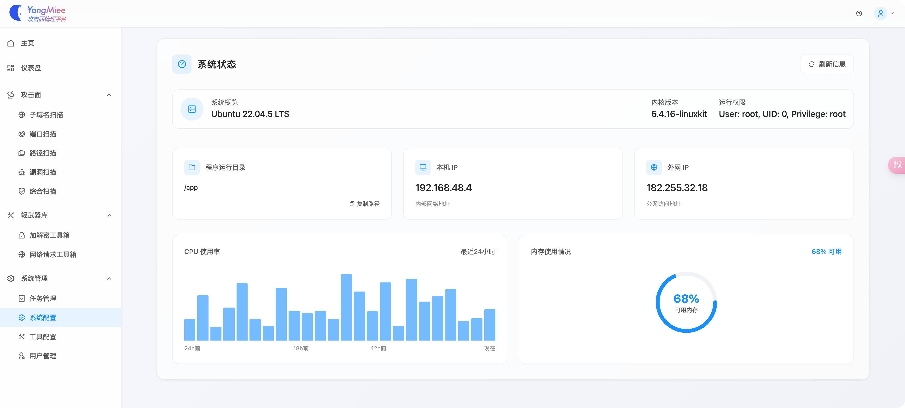

### 访问服务
* 统一访问入口: `http://ip:31337`

**注意：确保你的系统已安装 Docker 和 Docker Compose。**

### 问题排查

如果遇到服务启动问题，可以通过以下命令查看日志:
```bash
docker-compose logs -f
```

对于前端资源加载问题，可检查以下几点：
1. 确保dist目录中的资源正确复制到容器的/app/web/dist目录
2. 检查日志中是否有静态资源访问404错误
3. 验证/app/data目录是否有写入权限


### 手动构建

如果你需要手动构建项目，可以按照以下步骤：

1. 前端构建
```bash
# 克隆前端仓库
git clone https://github.com/LHXHL/YangMiee-Front.git
cd YangMiee-Front

# 安装依赖
npm install

# 构建前端项目
npm run build

# 将构建产物复制到后端的web/dist目录
cp -r dist ../YangMiee/web/
```

2. 后端构建
```bash
cd YangMiee
go build -o yangmiee ./cmd/yangmiee.go
```

3. 运行
```bash
# 生成.env文件，修改mongodb和redis的地址及账号密码
./generate_env.sh 
# 运行主程序
./yangmiee -env prod
```

### 首次使用

1. 通过浏览器访问 `http://ip:31337` 注册账号:
   - 注册过程需要使用 Google Authenticator 进行二次验证
   - 扫描二维码后会得到用户名和一次性密码

2. 安全建议:
   - 完成初始账号注册后，建议立即关闭注册通道以提升系统安全性
   - 确保修改默认密码和其他默认配置

### 注意事项

- 确保部署环境的端口31337未被占用
- 首次部署可能需要几分钟时间来下载和初始化所有组件
- 前后端已集成，无需单独部署前端

## 📺界面展示

### 登录
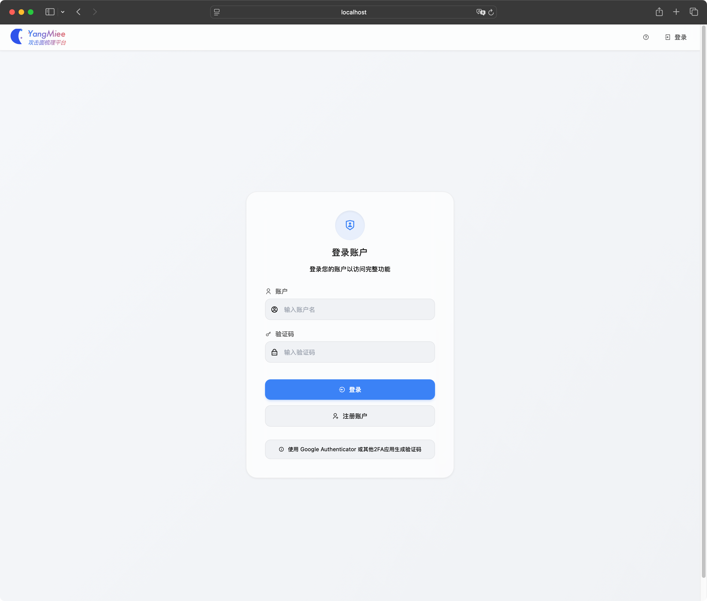
### 注册
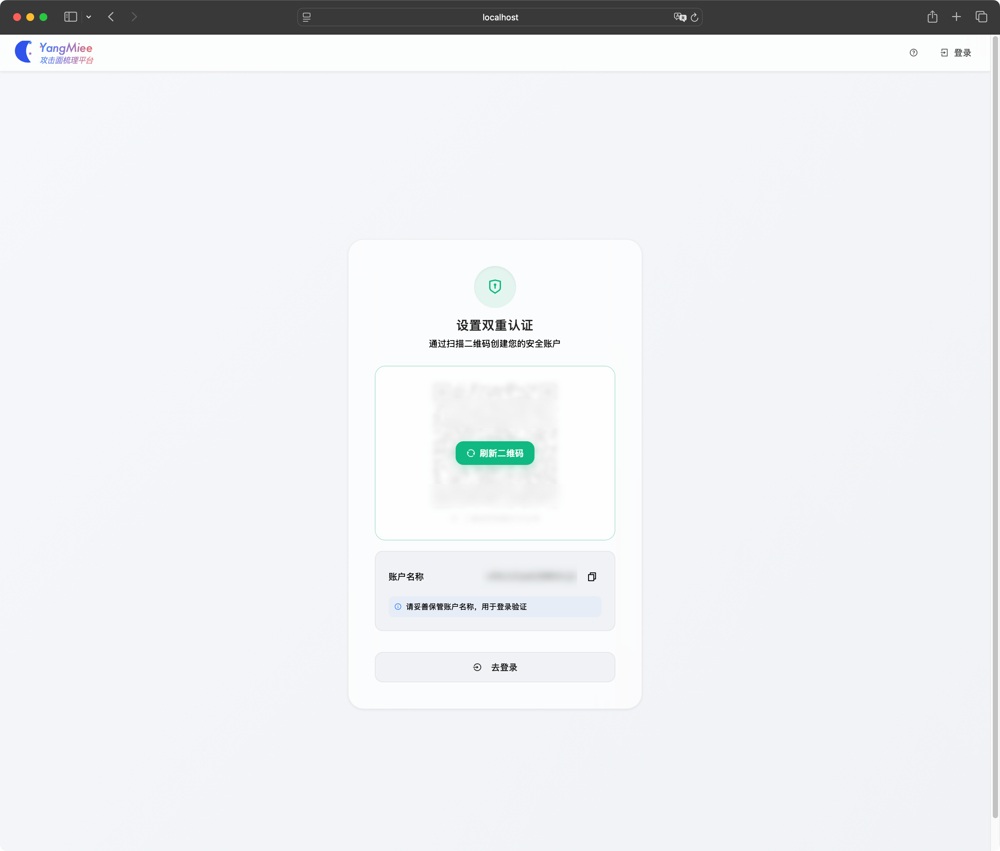
### 主页
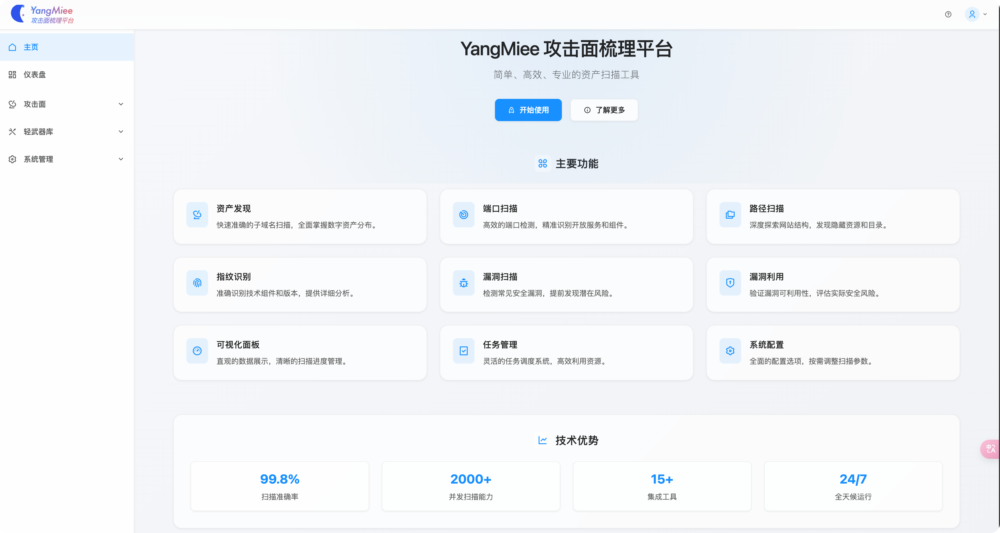
### 仪表盘
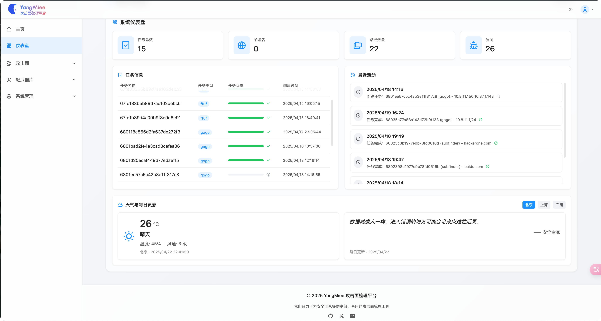
### 攻击面管理
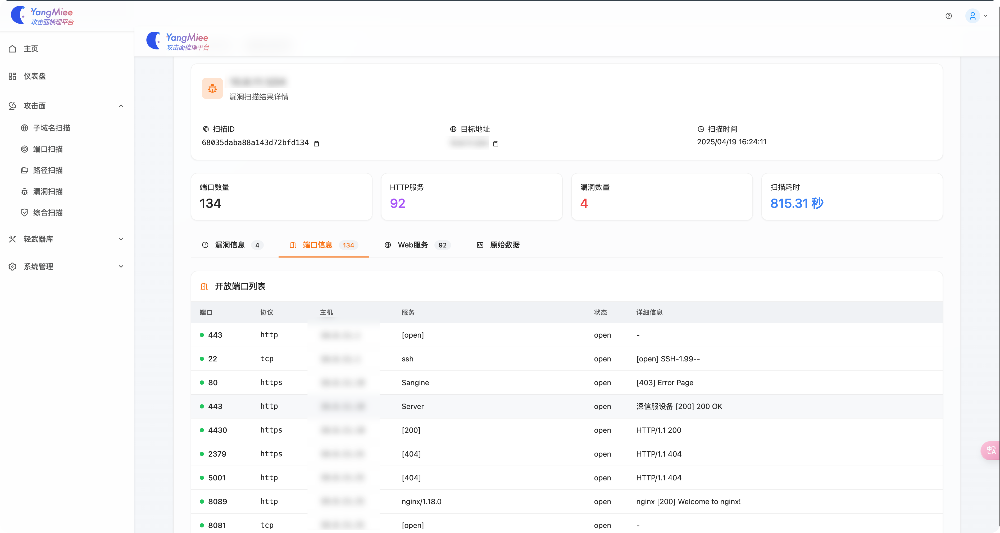

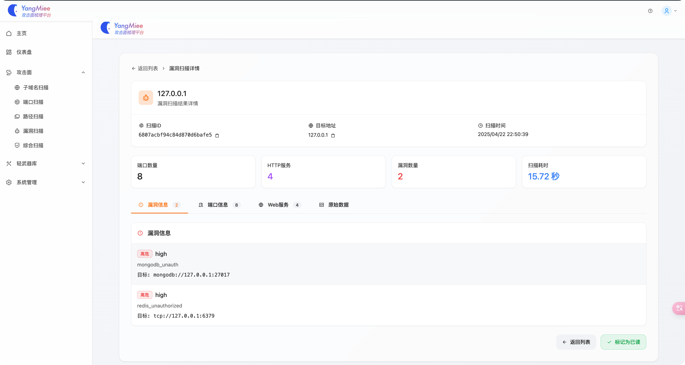
### 轻武器库
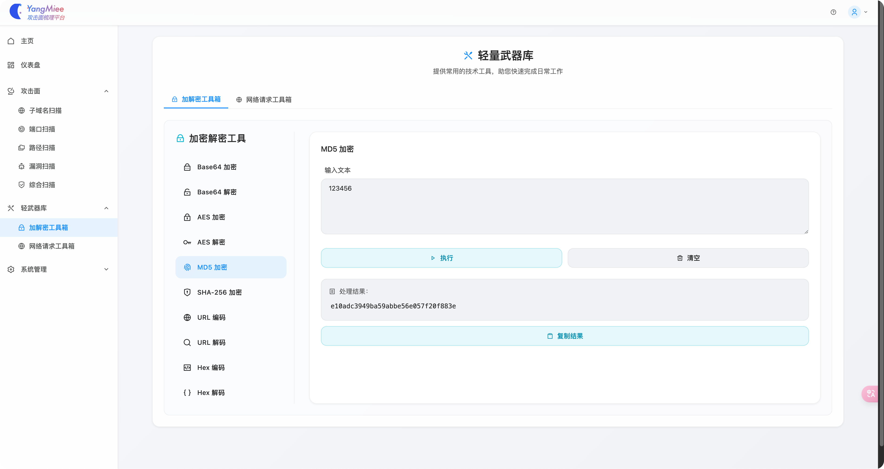
### 任务管理
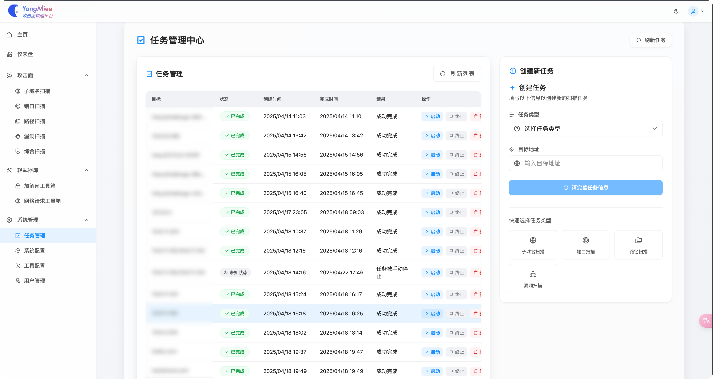
### 系统状态
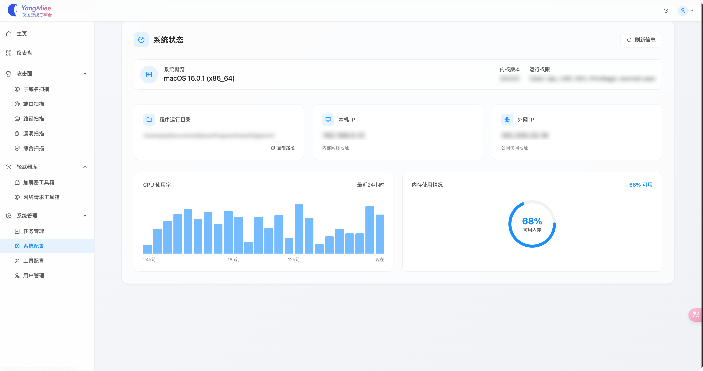
### 工具配置
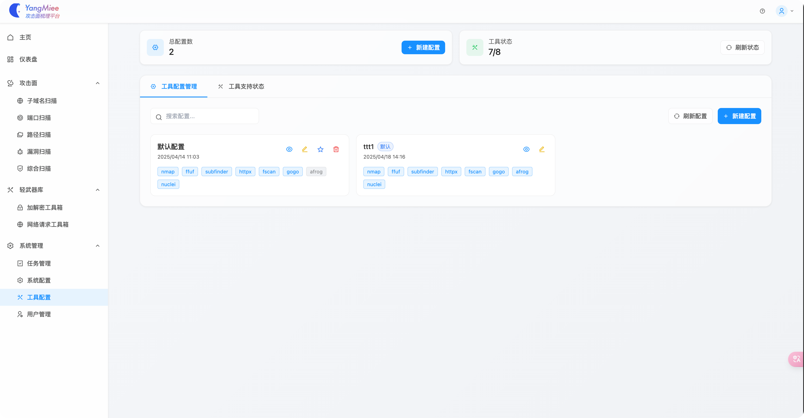
### 用户配置
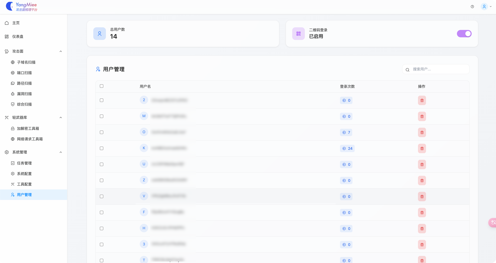


## 🪪许可证

YangMiee 项目采用 **GNU Affero 通用公共许可证 v3.0 (AGPL-3.0)**，这是一款确保软件自由使用、修改和分发的许可证，并且特别适用于网络应用。AGPL-3.0 要求在软件被修改、部署并对外提供服务时，必须公开相关的源代码。

### 核心条款

- **自由使用**：您可以自由地使用、修改和分发本项目的源代码。
- **开源义务**：如果您修改了 YangMiee，并将其作为服务提供给第三方使用，您必须公开您的修改内容及源代码。
- **衍生作品**：任何基于本项目的修改或衍生作品，都需要以 AGPL-3.0 许可证发布，继续保持开源。

### 重要提示

AGPL-3.0 扩展了 GNU GPL 的要求，特别针对网络应用的场景。无论是通过本地安装还是通过网络提供服务，您都需要遵守许可证的开源义务。这确保了用户在使用软件时依然享有自由获取源代码的权利。更多详细信息请参阅 [AGPL-3.0 官方文档](https://www.gnu.org/licenses/agpl-3.0.html)。 

**简要声明**：YangMiee 是自由软件，您可以在 AGPL-3.0 许可证下重新发布和修改，但需要保留此声明。

## 📮联系方式

Mail：qiucarys@gmail.com

QQ群：

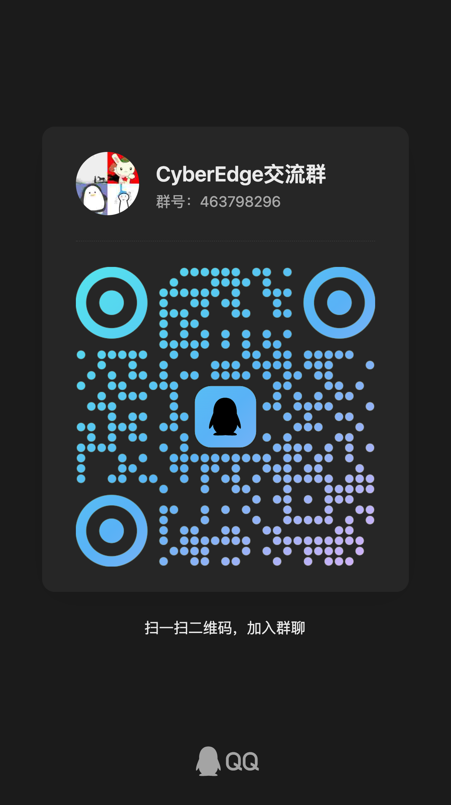